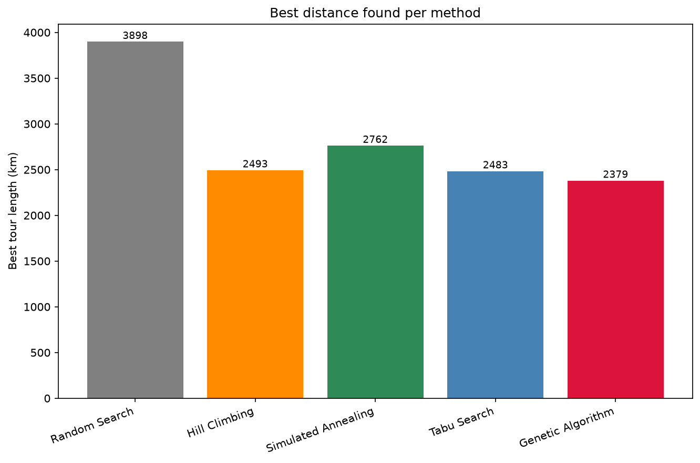
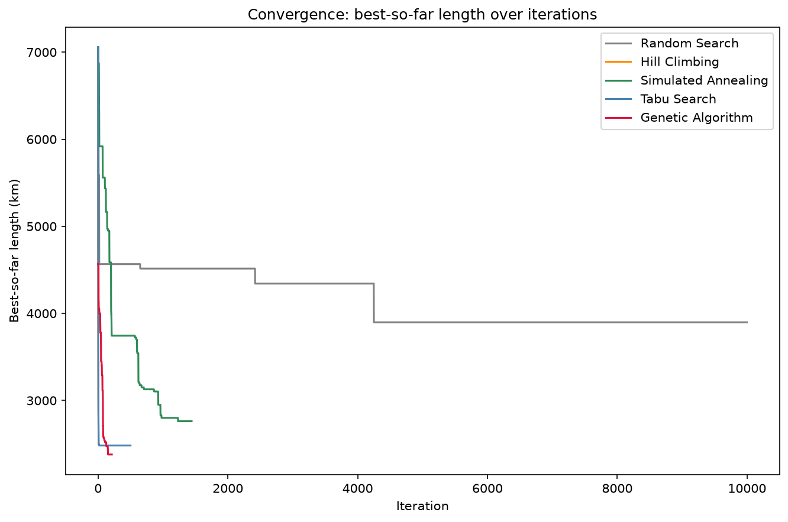

# TSP Algeria — Metaheuristics Comparison

Solving the Traveling Salesman Problem on 20 major Algerian cities using and comparing five metaheuristic search strategies: **Random Search**, **Hill Climbing**, **Simulated Annealing**, **Tabu Search**, and a **Genetic Algorithm**.



## Problem

Starting from Algiers, visit each of 19 other major Algerian cities exactly once and return to Algiers, minimizing total travel distance (straight-line Euclidean distance between (x, y) coordinates in km). With 20 cities there are 19! possible tours — far too many to brute-force — so the goal is to compare how well different search strategies approximate the optimal tour.

## Algorithms

| Method                  | Idea                                                                                                                                           |
| ----------------------- | ---------------------------------------------------------------------------------------------------------------------------------------------- |
| **Random Search**       | Generate random tours, keep the best. Pure baseline.                                                                                           |
| **Hill Climbing**       | Greedily move to the best neighboring tour (single-city swap) until no improvement is found.                                                   |
| **Simulated Annealing** | Like hill climbing, but accepts worse moves with a probability that shrinks as a "temperature" cools, escaping local optima early on.          |
| **Tabu Search**         | Hill climbing with a short-term memory of recent moves, forbidden for a number of iterations, to avoid cycling back to the same local optimum. |
| **Genetic Algorithm**   | Evolves a population of tours via order crossover, mutation, and roulette-wheel selection with elitism.                                        |

## Results

| Method              | Best length (km) |
| ------------------- | ---------------: |
| Random Search       |             4268 |
| Hill Climbing       |             2863 |
| Simulated Annealing |         **2353** |
| Tabu Search         |         **2353** |
| Genetic Algorithm   |             3526 |

Simulated Annealing and Tabu Search converge to the same tour length, suggesting this is close to (or is) the global optimum for this instance. The Genetic Algorithm underperforms Hill Climbing here — plausibly explained by weak mutation (a single swap, low probability) and no local-search refinement step, which is a known and expected trade-off for a "vanilla" GA on small TSP instances without a memetic/hybrid component.



## Project structure

```
tsp_algeria/
├── main.py                          # Runs all 5 methods, prints summary, saves plots
├── data/
│   └── algeria_20_cities_xy.csv     # 20 Algerian cities: name, lat, lon, x_km, y_km
├── tsp/
│   ├── problem.py                   # Load cities, distance matrix, tour_length, random_tour
│   └── neighborhood.py              # Move operators: swap and 2-opt neighbors
├── algorithms/
│   ├── local_search.py              # Generic accept/reject loop shared by HC, SA, Tabu
│   ├── random_search.py
│   ├── hill_climbing.py
│   ├── simulated_annealing.py
│   ├── tabu_search.py
│   └── genetic_algorithm.py
├── visualization/
│   ├── plot_tour.py                 # Draw a single tour on the map
│   └── plot_comparison.py           # Bar chart + convergence curves across all methods
└── results/                         # Saved plots (created on first run)
```

## Usage

```bash
git clone <repo-url>
cd tsp_algeria
pip install matplotlib

mkdir results   # required before the first run — savefig() won't create it
python main.py
```

This prints a summary table of best distances per method and saves tour plots, `comparison_bars.png`, and `convergence.png` to `results/`.

To run a single algorithm's module directly for testing (from the project root):

```bash
python -m algorithms.hill_climbing
python -m algorithms.simulated_annealing
```

Running a file inside `algorithms/` or `visualization/` directly (e.g. via an IDE's "Run" button) will raise `ModuleNotFoundError: No module named 'tsp'` — always run as a module from the project root, or run `main.py` directly.

## Notes

- Tours are represented as a list of city indices in visiting order, with Algiers fixed at index 0.
- All methods use `seed=42` for reproducibility, with iteration budgets tuned per method to give each a comparable amount of search effort (see comments in `main.py`).
- Distances are straight-line Euclidean, not real road distances.

## Author

BELAIDI Ramzy Zakaria — Master's student, USTHB (AI / Bioinformatics / CS)
